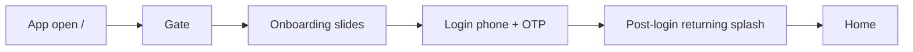
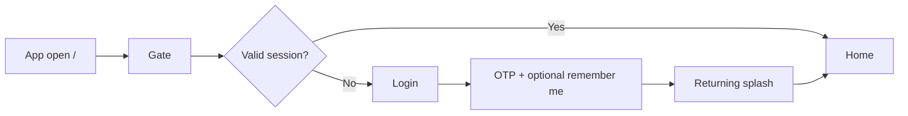
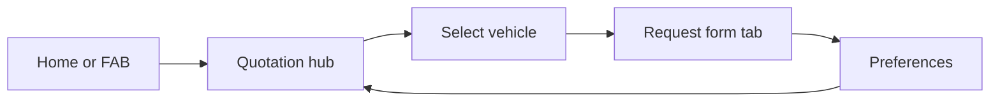

# PRD — PolicyStreet Consumer Car Insurance App (MVP)

**Product:** Consumer mobile-first web app (Angular)  
**Document purpose:** Jira epic/story source of truth for what is built, partial, and pending  
**Last updated:** May 2026  
**Related:** [features.md](../features.md), [navigation.md](./navigation.md), [frontend-review-checklist.md](./frontend-review-checklist.md)

---

## 1. Product summary

PolicyStreet’s consumer app lets Malaysian car insurance customers log in with mobile OTP, complete onboarding, and manage quotes, policies, claims, and profile from a dashboard-style home screen. The current build is an **MVP frontend** with mock data and local persistence; backend APIs are stubbed behind repository tokens.

**Primary personas**

| Persona | Description |
|---------|-------------|
| New user | First visit → onboarding slides → login → post-login splash → home |
| Returning user | Valid 30-day session or re-login → returning splash → home |
| Guest (future) | Marketing landing with login / quote entry — **not in app today** |

**Platform strategy (target vs built)**

| Surface | Target (product spec) | Current build |
|---------|----------------------|---------------|
| Mobile | Bottom nav: Home, Policies, New Quote (FAB), Claims, Profile | Implemented (≤430px column) |
| Desktop / web | Header nav: Home, Policies, Claims + Profile avatar in header | **Not implemented** — same mobile shell, centered column |
| Landing / marketing | Login entry in menu or quote section | **Not implemented** — app entry is `/` gate |

---

## 2. End-to-end user flows

### 2.1 First-time user

### 2.2 Returning user (remember me)

### 2.3 Request new quote (Malaysian / Foreigner)

---

## 3. Epic map (Jira)

| Epic | Summary | Overall status |
|------|---------|----------------|
| **PS-E01** | App entry, landing & login | Partial |
| **PS-E02** | Onboarding & post-login experience | Done |
| **PS-E03** | Home dashboard | Partial |
| **PS-E04** | Navigation & app shell | Partial (mobile only) |
| **PS-E05** | Support & WhatsApp | Done |
| **PS-E06** | Quotation (Get New Quote) | Partial |
| **PS-E07** | Policies & cover notes | Partial |
| **PS-E08** | Claims, profile & settings | Partial |
| **PS-E09** | Auth session & security | Partial (MVP client storage) |
| **PS-E10** | API integration & production hardening | Not started |

---

## 4. Stories by epic

### PS-E01 — App entry, landing & login

#### PS-101 — Landing page login entry point
**Platform:** Both (mobile + desktop)  
**Status:** Not started  
**Priority:** P1 (blocked on UI/UX landing redesign)

**User story**  
As a visitor, I want a clear login entry on the marketing landing page (menu or request-quote section) so I can access my account without guessing the URL.

**Acceptance criteria**
- [ ] Landing page design approved by UI/UX
- [ ] Login CTA visible on mobile and desktop breakpoints
- [ ] CTA placement documented (header menu vs quote hero — TBD with design)
- [ ] Tap/click navigates to `/login`
- [ ] Optional: deep link preserves `returnUrl` after login

**Current build notes**  
App root (`/`) uses `GateComponent` — routes to onboarding or login/home. No public marketing landing exists in this repo.

---

#### PS-102 — Login via Malaysian mobile number
**Platform:** Both  
**Status:** Done

**User story**  
As a user, I want to sign in with my Malaysian mobile number so I can receive an OTP.

**Acceptance criteria**
- [x] Phone field shows Malaysia flag + `+60` prefix + local digits (not full `0…` in input)
- [x] Validation for Malaysian mobile format
- [x] “Send OTP” disabled until number valid
- [x] Demo/stub OTP send via `AUTH_REPOSITORY.sendOtp()`
- [x] Figma-aligned login card layout and Pawsper hero animation

**Routes:** `/login`  
**Demo OTP:** `123456`

---

#### PS-103 — Login via 6-digit OTP
**Platform:** Both  
**Status:** Done

**User story**  
As a user, I want to enter a 6-digit OTP so I can complete login securely.

**Acceptance criteria**
- [x] Six single-digit inputs with paste support
- [x] “Login” enabled when all 6 digits entered
- [x] Invalid OTP shows error (demo: anything except `123456`)
- [x] “Use different mobile number” returns to phone step
- [x] “Resend OTP” with 60s countdown
- [x] Figma OTP container layout ([3087:21864](https://www.figma.com/design/aiW2eCYo3HQdeXRCAjq2Mh/Consumer-Car-Insurance?node-id=3087-21864))

---

#### PS-104 — Keep me logged in for 30 days
**Platform:** Both  
**Status:** Done (MVP client session; API upgrade pending)

**User story**  
As a returning user, I want to stay logged in for 30 days so I don’t re-enter OTP every visit.

**Acceptance criteria**
- [x] Checkbox label: “Keep me logged in for 30 days.”
- [x] **Default: checked** (Figma)
- [x] When checked: session persisted in `localStorage` for 30 days
- [x] When unchecked: tab-scoped session in `sessionStorage` (clears when tab closes)
- [x] Valid session skips login (gate → `/home`)
- [x] Logout clears session (Profile → Logout → `/login`)

**Production follow-up (PS-901)**
- [ ] Server-issued refresh token in httpOnly Secure cookie
- [ ] Token rotation and revoke on logout
- [ ] Do not store long-lived tokens in `localStorage` in production

---

### PS-E02 — Onboarding & post-login experience

#### PS-201 — First-time onboarding welcome slides
**Platform:** Both  
**Status:** Done

**User story**  
As a new user, I want a welcome tour so I understand PolicyStreet before logging in.

**Acceptance criteria**
- [x] Multi-slide carousel with skip and CTA
- [x] Completion stored in `LocalOnboardingStorage`
- [x] Gate sends incomplete onboarding users to `/onboarding`
- [x] After completion, user proceeds to login flow

---

#### PS-202 — Post-login splash (new vs returning)
**Platform:** Both  
**Status:** Done

**User story**  
After OTP login, I want appropriate feedback — a welcome/splash — before reaching home.

**Acceptance criteria**
- [x] After successful OTP → `/onboarding?postLogin=1`
- [x] Returning users: full-screen VP9/WebM splash (MP4 fallback), then auto-navigate to `/home`
- [x] New users: existing onboarding path applies before login; post-login uses returning splash
- [x] Header hidden during returning splash

---

### PS-E03 — Home dashboard

#### PS-301 — Hero: Hello, {Name}
**Platform:** Both  
**Status:** Done (mock user)

**User story**  
As a logged-in user, I want a personalized greeting on home.

**Acceptance criteria**
- [x] Hero shows “Hello,” + user display name
- [x] Branded header with PolicyStreet logo
- [x] Parallax-style hero + scrollable white sheet
- [ ] Name from authenticated user profile API (today: `SAMPLE_USER` fixture)

---

#### PS-302 — Quick actions
**Platform:** Both  
**Status:** Partial

**User story**  
As a user, I want shortcuts to common tasks from home.

**Acceptance criteria**
- [x] **Request New Quote** → `/quotation`
- [x] **Contact Support** → `/contact-support`
- [x] **Add New Vehicle** → `/my-vehicles` (label says “Add New Vehicle”; spec says “Add vehicles”)
- [ ] Product confirmation: “Add vehicle” vs “Add new vehicle” copy
- [ ] Empty/error states if my-vehicles API fails

---

#### PS-303 — Active quote section
**Platform:** Both  
**Status:** Done (local persistence)

**User story**  
As a user, I want to see my latest in-progress quote on home.

**Acceptance criteria**
- [x] Section title “Active Quote” + “View All” → quotation hub
- [x] Shows latest quote card when in-progress quote exists (`active-quotes.storage`)
- [x] Empty state when no active quote
- [x] Ready-state notice dismiss + “View quote” when applicable
- [ ] Sync with backend quote API when available

---

#### PS-304 — Latest cover note section
**Platform:** Both  
**Status:** Done (mock policies)

**User story**  
As a user, I want to see my most recent active cover note / policy on home.

**Acceptance criteria**
- [x] Section “Latest Cover Note” with sticky header on scroll
- [x] Card shows plate, vehicle, coverage, status pill, expiry label
- [x] Tap card → policy details (`/policies/:id`)
- [x] “View All” → policies list (active filter query param)
- [x] Empty state when no active policy
- [ ] “Latest” selection rule owned by API (today: prefers demo plate `ABC1234`)

---

#### PS-305 — News & articles
**Platform:** Both  
**Status:** Partial

**User story**  
As a user, I want to read PolicyStreet news and blog articles from home.

**Acceptance criteria**
- [x] Horizontal news card row with thumbnail + title (mock content)
- [ ] **View All** links to PolicyStreet blog / CMS URL (not wired)
- [ ] Individual cards open article URL in browser
- [ ] Content from CMS/API, not static fixture

**Current build:** `HOME_NEWS_ITEMS` fixture; View All button has no handler.

---

#### PS-306 — Promotional carousel (home)
**Platform:** Both  
**Status:** Done (mock)

**Acceptance criteria**
- [x] Promo banner carousel in hero area (mock asset)
- [ ] CMS-driven creatives and tap-through URLs

---

### PS-E04 — Navigation & app shell

#### PS-401 — Mobile bottom navigation
**Platform:** Mobile  
**Status:** Done

**User story**  
As a mobile user, I want primary navigation always available on main tabs.

**Acceptance criteria**
- [x] Fixed bottom bar on: Home, Policies, Claims, Profile routes
- [x] Tabs: **Home**, **Policies**, center **New Quote FAB**, **Claims**, **Profile**
- [x] FAB → `/quotation/new` (vehicle selection)
- [x] Active tab highlight + `aria-current="page"`
- [x] Hidden on wizard/nested flows (login, quotation steps, etc.) via route `data`

---

#### PS-402 — Desktop / web header navigation
**Platform:** Desktop (web)  
**Status:** Not started  
**Priority:** P1 (design dependency)

**User story**  
As a desktop user, I want a horizontal nav bar instead of a phone bottom bar.

**Acceptance criteria**
- [ ] Breakpoint strategy defined (e.g. ≥768px or ≥1024px)
- [ ] Header links: **Home**, **Policies**, **Claims**
- [ ] **Profile avatar** in header (not in bottom bar)
- [ ] New Quote entry in header or persistent CTA (align with landing redesign)
- [ ] Bottom nav hidden at desktop breakpoint
- [ ] Keyboard and focus order accessible

**Current build:** Mobile bottom nav only; layout max-width ~430px centered on large screens.

---

#### PS-403 — Skip link & landmarks
**Platform:** Both  
**Status:** Done

**Acceptance criteria**
- [x] “Skip to main content” link in app shell
- [x] `id="main-content"` on routed pages
- [x] Route transition fade without view-transition flicker

---

### PS-E05 — Support & WhatsApp

#### PS-501 — WhatsApp floating widget
**Platform:** Both  
**Status:** Done

**User story**  
As a user, I want quick WhatsApp access to support from key screens.

**Acceptance criteria**
- [x] FAB opens `https://wa.me/60182822320`
- [x] Shown on home, profile, contact-support, quotation form/prefs
- [x] Position adjusts above bottom nav / quotation footers
- [x] Shared `WhatsappFabComponent` + `WHATSAPP_HREF` constant

---

#### PS-502 — Contact support page
**Platform:** Both  
**Status:** Done

**Acceptance criteria**
- [x] Address, hours, phone, email, WhatsApp channels
- [x] Page chrome with back navigation
- [x] Reachable from home quick action and profile menu

---

### PS-E06 — Quotation (Get New Quote)

#### PS-601 — Quotation hub & vehicle selection
**Platform:** Both  
**Status:** Done (mock vehicles)

**Acceptance criteria**
- [x] Hub lists in-progress quotes + “Get new quote”
- [x] Step 2: select vehicle from user’s motor policies
- [x] Add vehicle → `/my-vehicles/add` with return path
- [x] `QuotationFlowService` centralizes wizard navigation

---

#### PS-602 — Request form — Malaysian customer
**Platform:** Both  
**Status:** Done

**Acceptance criteria**
- [x] Customer tabs: Malaysian, Foreigner, Company, Commercial
- [x] Malaysian: identity type, insurance type, plate, owner IC, postcode, mobile, email, consent
- [x] Insurance type info tooltip
- [x] Continue → preferences step

---

#### PS-603 — Request form — Foreigner customer
**Platform:** Both  
**Status:** Done

**Acceptance criteria**
- [x] Gender (Male/Female)
- [x] Passport number (not IC), nationality dropdown, date of birth
- [x] Figma page 1 ([13:29944](https://www.figma.com/design/aiW2eCYo3HQdeXRCAjq2Mh/Consumer-Car-Insurance?node-id=13-29944))
- [x] CTA label **Next**

---

#### PS-604 — Preferences — Malaysian customer
**Platform:** Both  
**Status:** Done

**Acceptance criteria**
- [x] E-hailing usage, marital status, contact method radios
- [x] “Find the BEST prices!” submits quote to in-progress storage → hub

---

#### PS-605 — Preferences — Foreigner customer
**Platform:** Both  
**Status:** Done

**Acceptance criteria**
- [x] Marital status + contact method only (no e-hailing)
- [x] **Back** outline button + **Find The BEST Price!**
- [x] Figma page 2 ([13:29938](https://www.figma.com/design/aiW2eCYo3HQdeXRCAjq2Mh/Consumer-Car-Insurance?node-id=13-29938))

---

#### PS-606 — Company / Commercial tabs
**Platform:** Both  
**Status:** Not started (explicit “Coming soon”)

**Acceptance criteria**
- [ ] Disabled or coming-soon UX (currently shown)
- [ ] Full flows when product defines company/commercial fields

---

#### PS-607 — Quote results & checkout
**Platform:** Both  
**Status:** Not started

**Acceptance criteria**
- [ ] After “Find best prices”, pricing comparison screen
- [ ] Purchase / bind policy journey
- [ ] Today: in-progress timer + “ready” mock state only

---

### PS-E07 — Policies & cover notes

#### PS-701 — Policies list
**Platform:** Both  
**Status:** Done (mock)

**Acceptance criteria**
- [x] List with status chips (Active, Expiring Soon, Expired)
- [x] ≤3 vehicles expanded; >3 accordion
- [x] Renew Now + View Details actions (Renew placeholder)
- [x] Bottom nav tab: Policies

---

#### PS-702 — Policy details
**Platform:** Both  
**Status:** Partial

**Acceptance criteria**
- [x] Route `/policies/:id` with sections per Figma structure
- [x] Renew Now disabled for ACTIVE policies (demo rule)
- [ ] Renew journey wired to product flow
- [ ] Document download functional

---

### PS-E08 — Claims, profile & settings

#### PS-801 — Claims hub
**Platform:** Both  
**Status:** Partial (layout + mock)

**Acceptance criteria**
- [x] Claims screen reachable from bottom nav
- [ ] File/track claim flows
- [ ] API-backed claim list

---

#### PS-802 — Profile & logout
**Platform:** Both  
**Status:** Partial

**Acceptance criteria**
- [x] Profile summary, menu sections, referral card
- [x] Edit details → `/profile/edit`
- [x] FAQ, Contact Support links
- [x] Logout clears auth session → login
- [ ] Dynamic user data from API
- [ ] Refer & Earn functional

---

#### PS-803 — My vehicles
**Platform:** Both  
**Status:** Partial

**Acceptance criteria**
- [x] List vehicles (shared motor policy fixture)
- [x] Add vehicle form UI
- [ ] Persist new vehicles via API

---

#### PS-804 — Notifications
**Platform:** Both  
**Status:** Partial (mock list)

**Acceptance criteria**
- [x] Notifications list UI from home header entry
- [ ] Push notifications + server sync

---

#### PS-805 — Documents
**Platform:** Both  
**Status:** Partial

**Acceptance criteria**
- [x] Documents hub + upload UI shell
- [ ] Upload pipeline, view/download/delete backends

---

### PS-E09 — Auth session & security (production)

#### PS-901 — Production auth & session hardening
**Platform:** Both  
**Status:** Not started  
**Priority:** P0 before production launch

**Acceptance criteria**
- [ ] Real SMS OTP via auth API
- [ ] httpOnly refresh cookie for “remember me 30 days”
- [ ] Auth guards on protected routes
- [ ] Session revoke on logout server-side
- [ ] Rate limiting / OTP brute-force protection (backend)

---

#### PS-902 — Route guards
**Platform:** Both  
**Status:** Not started

**Acceptance criteria**
- [ ] Unauthenticated users redirected from `/home`, `/policies`, etc.
- [ ] Gate + login session logic replaced/supplemented by guard + API validation

---

### PS-E10 — API integration & QA

#### PS-1001 — Replace mock repositories
**Status:** Not started

| Domain | Token | Current stub |
|--------|-------|--------------|
| Auth | `AUTH_REPOSITORY` | `AuthRepositoryStub` |
| Policies | `POLICY_REPOSITORY` | `PolicyRepositoryStub` |
| Onboarding | `ONBOARDING_STORAGE` | `LocalOnboardingStorage` |
| Auth session | `AUTH_SESSION_STORAGE` | `LocalAuthSessionStorage` |
| Quotation | localStorage | `active-quotes.storage`, owner preferences |

---

#### PS-1002 — CI & regression
**Status:** Done (partial)

**Acceptance criteria**
- [x] `npm run build` + `npm run test:ci` in GitHub Actions
- [x] 23 unit tests (storage, validation, auth session)
- [ ] ESLint gate (deferred)
- [ ] E2E smoke (login → home → quote)

---

## 5. Non-functional requirements

| Area | Requirement | Status |
|------|-------------|--------|
| Accessibility | Skip link, main landmarks, focus rings, tab `aria-controls` | Done (baseline) |
| Performance | Lazy-loaded routes, asset session cache | Done |
| Design tokens | Generated SCSS tokens from JSON | Done (rollout ongoing) |
| Mobile viewport | Max-width 430px primary target | Done |
| Responsive desktop | Separate web nav + layout | **Not done** |
| i18n | English only | Done |
| Analytics | — | Not started |

---

## 6. Out of scope (MVP)

- Payment / checkout
- Real-time quote pricing from insurers
- Push notifications (native)
- Company / Commercial quotation tabs (beyond coming-soon)
- Marketing CMS / landing page (separate redesign track)
- Admin or agent portals

---

## 7. Open product decisions (for Jira spikes)

| ID | Question | Owner |
|----|----------|-------|
| OD-01 | Landing login CTA: header menu vs quote section vs both? | UI/UX |
| OD-02 | Desktop breakpoint and web header layout | UI/UX + Eng |
| OD-03 | News/blog: external URL vs in-app WebView | Product |
| OD-04 | “Add vehicles” quick action: my-vehicles vs add-vehicle directly | Product |
| OD-05 | Post-login: always splash vs skip if session refreshed | Product |
| OD-06 | Production auth: cookie-only vs BFF pattern | Eng + Security |

---

## 8. Suggested Jira import checklist

Copy each **PS-xxx** story above as a Jira Story under its Epic. Suggested labels:

- `consumer-app`, `mvp`, `mobile`, `desktop`, `auth`, `home`, `quotation`, `nav`

Suggested story fields:

| Field | Value |
|-------|-------|
| **Component** | Consumer Web App |
| **Fix versions** | MVP Sprint N (map per team) |
| **Story points** | 1–8 per story (team estimate) |
| **Definition of Done** | Merged, build green, AC checked, demo OTP/docs updated if auth |

**Quick status summary for stakeholders**

| Area | Built | Remaining |
|------|-------|-----------|
| Login + OTP + 30-day remember me | Yes | Production auth API |
| Onboarding + returning splash | Yes | — |
| Home dashboard core sections | Yes | News links, API data |
| Mobile bottom nav + WhatsApp | Yes | — |
| Desktop web nav + profile header | No | Design + eng |
| Landing page login entry | No | Landing redesign |
| Quotation MY + Foreigner | Yes | Company/Commercial, results |
| Policies / claims / documents | UI + mocks | APIs |
| Route guards | No | With auth API |

---

*This PRD reflects the repository state at time of writing. Update story statuses as Jira tickets close.*
